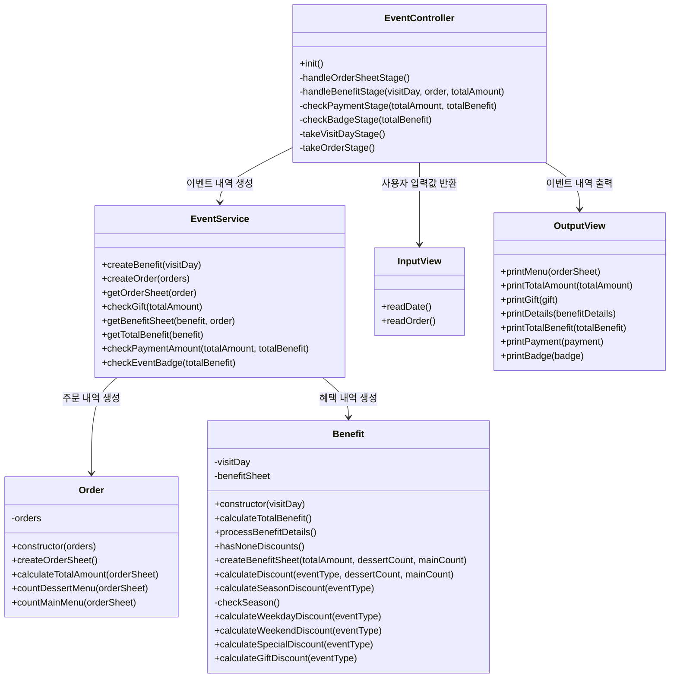
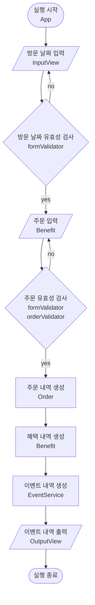

## 🎄 크리스마스 이벤트 플래너 🎄

고객들이 식당에 방문할 날짜와 메뉴를 미리 선택하면 주문 메뉴, 할인 전 총주문 금액, 증정 메뉴, 혜택 내역, 총혜택 금액, 할인 후 예상 결제 금액, 12월 이벤트 배지 내용을 확인할 수 있도록 한다.

<br>

## 🚀 구현 기능 목록

### 메뉴 종류 구분(menus)

- [x] 판매중인 메뉴의 종류와 가격 정보를 저장한다.

### 주문(Order)

- [x] 고객이 주문한 메뉴의 이름과 개수가 담긴 주문 내역을 만든다.
- [x] 총주문 금액을 계산한다.
- [x] 이벤트에 적용되는 메뉴 종류의 개수를 구한다.
- [x] 예외 처리
  - [x] 총 주문 개수가 20개 이상인 경우
  - [x] 메뉴판에 없는 메뉴인 경우
  - [x] 중복 메뉴가 있는 경우
  - [x] 음료만 주문하는 경우

### 이벤트 정보(events)

- [x] 이벤트 종류별 날짜, 기간, 조건, 할인 금액, 증정 메뉴 등의 정보를 저장한다.

### 혜택(Benefit)

- [x] 방문 날짜에 따른 할인 금액을 계산한다.
- [x] 이벤트 종류별 금액 조건에 해당하는 경우 할인 금액을 계산한다.
- [x] 혜택 내역을 만든다.
- [x] 총혜택 금액을 계산한다.

### 배지(events)

- [x] 배지의 이름과 금액 조건 정보를 저장한다.

### 이벤트 서비스(EventService)

- [x] 증정 여부를 구한다.
- [x] 총주문 금액, 총혜택 금액, 증정품의 가격을 반영하여 예상 결제 금액을 계산한다.
- [x] 총혜택 금액에 따른 배지 종류를 결정한다.
- [x] 고객에게 보여줄 항목들을 가져온다.

### 입력(InputView)

- [x] 방문 날짜 예외 처리
  - [x] 숫자가 아닌 경우
  - [x] 이벤트 기간인 1~31 범위를 벗어나는 경우
- [x] 주문 형식 예외 처리
  - [x] 메뉴 이름이 없는 경우
  - [x] 주문 개수가 숫자가 아닌 경우
  - [x] 주문 개수가 1개 미만인 경우
- [x] 사용자가 잘못된 값을 입력할 경우 `throw`문을 사용해 예외를 발생시킨다. 그런 다음, "[ERROR]"로 시작하는 에러 메시지를 출력하고 해당 부분부터 입력을 다시 받는다.

### 출력(OutputView)

- [x] 이벤트 내역마다 제목 출력
- [x] 금액은 1,000원 단위마다 쉼표(,)로 구분
- [x] 혜택 내역의 출력 순서는 자유롭게 출력 가능

#### 출력 예시

```
안녕하세요! 우테코 식당 12월 이벤트 플래너입니다.
12월 중 식당 예상 방문 날짜는 언제인가요? (숫자만 입력해 주세요!)
3
주문하실 메뉴를 메뉴와 개수를 알려 주세요. (e.g. 해산물파스타-2,레드와인-1,초코케이크-1)
티본스테이크-1,바비큐립-1,초코케이크-2,제로콜라-1
12월 3일에 우테코 식당에서 받을 이벤트 혜택 미리 보기!

<주문 메뉴>
티본스테이크 1개
바비큐립 1개
초코케이크 2개
제로콜라 1개

<할인 전 총주문 금액>
142,000원

<증정 메뉴>
샴페인 1개

<혜택 내역>
크리스마스 디데이 할인: -1,200원
평일 할인: -4,046원
특별 할인: -1,000원
증정 이벤트: -25,000원

<총혜택 금액>
-31,246원

<할인 후 예상 결제 금액>
135,754원

<12월 이벤트 배지>
산타
```

<br>

## 📂 파일 구조

```
src
 ┣ constants
 ┃ ┣ errors.js
 ┃ ┣ events.js
 ┃ ┣ menus.js
 ┃ ┗ texts.js
 ┣ controller
 ┃ ┗ EventController.js
 ┣ domain
 ┃ ┣ Benefit.js
 ┃ ┗ Order.js
 ┣ service
 ┃ ┗ EventService.js
 ┣ utils
 ┃ ┣ CustomError.js
 ┃ ┣ formValidator.js
 ┃ ┗ orderValidator.js
 ┣ views
 ┃ ┣ InputView.js
 ┃ ┗ OutputView.js
 ┣ App.js
 ┗ index.js

```

<br>

## 🔗 Class Diagram



<br>

## 📈 Flow Chart


